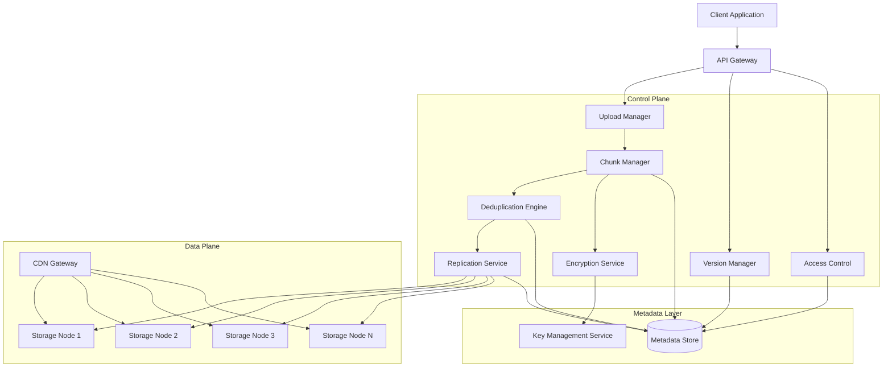

# Design Document: Distributed File Storage System

## Overview

The Distributed File Storage System is a cloud-native storage platform designed for high availability, scalability, and data durability. The system employs a content-addressed storage architecture where files are divided into fixed-size chunks (8MB), deduplicated using SHA-256 content hashing, and replicated across multiple storage nodes for fault tolerance.

### Key Design Principles

1. **Content-Addressable Storage**: Chunks are identified by their SHA-256 hash, enabling automatic deduplication and integrity verification
2. **Fixed-Size Chunking**: Using 8MB fixed-size chunks provides predictable performance characteristics and simplifies chunk management compared to variable-size content-defined chunking (CDC)
3. **Eventual Consistency with Strong Guarantees**: Metadata operations use ACID transactions while chunk replication follows eventual consistency with quorum-based reads
4. **Separation of Concerns**: Clear boundaries between chunk management, replication, deduplication, encryption, and delivery layers
5. **Immutable Chunks**: Once written, chunks are never modified, simplifying caching and replication logic

### Design Rationale

**Fixed-Size vs Variable-Size Chunking**: While content-defined chunking (CDC) offers better deduplication for modified files ([source](https://arxiv.org/html/2509.11121v1)), we chose fixed-size 8MB chunks because:
- Predictable memory usage and I/O patterns
- Simpler implementation without rolling hash computation overhead
- Sufficient deduplication for identical files and common data blocks
- Better alignment with storage node block sizes

**Consistent Hashing for Node Selection**: We employ consistent hashing with virtual nodes ([source](https://www.toptal.com/big-data/consistent-hashing)) to distribute chunks across storage nodes, minimizing data movement when nodes are added or removed (only ~1/N keys need to move).

**Quorum-Based Replication**: With a replication factor of 3, we use quorum reads (R=2) and writes (W=2) to balance consistency and availability ([source](https://www.cockroachlabs.com/blog/fundamental-tradeoffs-distributed-databases)), ensuring that R + W > N guarantees read-your-writes consistency.

## Architecture

### High-Level Architecture



### Component Interaction Flow

**Upload Flow**:
1. Client initiates upload → API Gateway authenticates → Upload Manager creates session
2. Client uploads chunks in parallel → Chunk Manager computes SHA-256 hash
3. Deduplication Engine checks if hash exists → If new, Encryption Service encrypts chunk
4. Replication Service writes to 3 storage nodes using consistent hashing
5. Metadata Store records chunk location, reference count, and file association
6. Upload Manager marks session complete when all chunks received

**Download Flow**:
1. Client requests file → API Gateway authenticates → Access Control verifies permissions
2. CDN Gateway checks edge cache → If miss, routes to nearest storage node
3. Chunk Manager retrieves chunk locations from Metadata Store
4. Parallel chunk retrieval from storage nodes (up to 10 concurrent)
5. Encryption Service decrypts chunks → Chunk Manager reassembles file
6. CDN Gateway caches chunks at edge location

### Scalability Considerations

- **Horizontal Scaling**: Storage nodes can be added dynamically; consistent hashing minimizes data redistribution
- **Metadata Sharding**: Metadata Store is sharded by file ID hash to distribute load
- **CDN Edge Locations**: Geographic distribution reduces latency for global users
- **Parallel Operations**: Upload and download support up to 10 concurrent chunk transfers

## Components and Interfaces

### 1. Chunk Manager

**Responsibilities**:
- Split files into 8MB fixed-size chunks
- Compute SHA-256 content hash for each chunk
- Reassemble chunks into original files
- Maintain chunk sequence ordering

**Interface**:
```typescript
interface ChunkManager {
  // Split file into chunks and return chunk metadata
  chunkFile(fileId: string, fileData: Buffer): Promise<ChunkMetadata[]>;
  
  // Reassemble chunks into original file
  assembleFile(fileId: string, version: number): Promise<Buffer>;
  
  // Verify chunk integrity
  verifyChunk(chunkHash: string, chunkData: Buffer): boolean;
}

interface ChunkMetadata {
  fileId: string;
  sequenceNumber: number;
  contentHash: string;  // SHA-256 hash
  size: number;         // Bytes
  encryptedSize: number; // Bytes after encryption
}
```

**Implementation Notes**:
- Uses streaming API to handle files larger than available memory
- Chunk size of 8MB balances network transfer efficiency with memory usage
- Final chunk may be smaller than 8MB

### 2. Replication Service

**Responsibilities**:
- Maintain 3 replicas of each chunk across distinct storage nodes
- Select storage nodes using consistent hashing with virtual nodes
- Monitor replica health and trigger re-replication when needed
- Prefer nodes in different availability zones for fault tolerance

**Interface**:
```typescript
interface ReplicationService {
  // Replicate chunk to 3 storage nodes
  replicateChunk(chunkHash: string, chunkData: Buffer): Promise<ReplicaLocation[]>;
  
  // Check replica health and trigger re-replication if needed
  verifyReplicas(chunkHash: string): Promise<ReplicaHealth>;
  
  // Select optimal storage nodes for new chunk
  selectStorageNodes(chunkHash: string, count: number): Promise<StorageNode[]>;
  
  // Re-replicate chunk when replica count drops below threshold
  reReplicate(chunkHash: string): Promise<void>;
}

interface ReplicaLocation {
  nodeId: string;
  availabilityZone: string;
  timestamp: Date;
}

interface ReplicaHealth {
  chunkHash: string;
  replicaCount: number;
  healthyReplicas: number;
  corruptedReplicas: string[];  // Node IDs
}
```

**Implementation Notes**:
- Uses consistent hashing ring with 150 virtual nodes per physical node
- Quorum writes: W=2 (wait for 2 of 3 replicas to acknowledge)
- Background integrity verification runs every 24 hours
- Re-replication triggered within 5 minutes when replica count < 3

### 3. Deduplication Engine

**Responsibilities**:
- Detect duplicate chunks using SHA-256 content hash
- Maintain reference counts for each unique chunk
- Delete chunks when reference count reaches zero
- Track storage efficiency metrics

**Interface**:
```typescript
interface DeduplicationEngine {
  // Check if chunk already exists and return existing hash or null
  checkDuplicate(chunkHash: string): Promise<DuplicateCheckResult>;
  
  // Increment reference count for existing chunk
  incrementReference(chunkHash: string, fileId: string): Promise<void>;
  
  // Decrement reference count when file is deleted
  decrementReference(chunkHash: string, fileId: string): Promise<void>;
  
  // Get chunks with zero references for garbage collection
  getOrphanedChunks(): Promise<string[]>;
  
  // Calculate deduplication ratio
  getDeduplicationRatio(): Promise<number>;
}

interface DuplicateCheckResult {
  exists: boolean;
  chunkHash: string;
  referenceCount: number;
  replicaLocations?: ReplicaLocation[];
}
```

**Implementation Notes**:
- Reference counting uses atomic increment/decrement operations
- Garbage collection runs daily to delete chunks with zero references
- Deduplication ratio = logical data size / physical storage used

### 4. Upload Manager

**Responsibilities**:
- Create and manage upload sessions
- Track which chunks have been successfully uploaded
- Support resumable uploads with 7-day session persistence
- Accept chunks in any order (out-of-order upload)

**Interface**:
```typescript
interface UploadManager {
  // Create new upload session
  createSession(fileId: string, fileName: string, totalChunks: number, userId: string): Promise<UploadSession>;
  
  // Resume existing upload session
  resumeSession(sessionId: string): Promise<UploadSession>;
  
  // Mark chunk as uploaded
  markChunkUploaded(sessionId: string, sequenceNumber: number, chunkHash: string): Promise<void>;
  
  // Check if upload is complete
  isUploadComplete(sessionId: string): Promise<boolean>;
  
  // Finalize upload and create file metadata
  finalizeUpload(sessionId: string): Promise<FileMetadata>;
  
  // Clean up expired sessions (older than 7 days)
  cleanupExpiredSessions(): Promise<void>;
}

interface UploadSession {
  sessionId: string;
  fileId: string;
  fileName: string;
  totalChunks: number;
  uploadedChunks: Set<number>;  // Sequence numbers
  createdAt: Date;
  expiresAt: Date;
  userId: string;
}
```

**Implementation Notes**:
- Session state persisted in Metadata Store
- Supports parallel upload of up to 10 chunks
- Chunks can be uploaded in any order
- Session expires after 7 days of inactivity

### 5. CDN Gateway

**Responsibilities**:
- Route download requests to nearest edge location
- Cache frequently accessed chunks at edge locations
- Invalidate cached chunks when files are updated
- Support byte-range requests for partial downloads

**Interface**:
```typescript
interface CDNGateway {
  // Retrieve chunk from cache or origin
  getChunk(chunkHash: string, clientLocation: GeoLocation): Promise<Buffer>;
  
  // Invalidate cached chunks for a file version
  invalidateCache(fileId: string, version: number): Promise<void>;
  
  // Handle byte-range request
  getChunkRange(chunkHash: string, startByte: number, endByte: number): Promise<Buffer>;
  
  // Get cache statistics
  getCacheStats(edgeLocation: string): Promise<CacheStats>;
}

interface CacheStats {
  hitRate: number;
  missRate: number;
  evictionRate: number;
  averageLatency: number;
}
```

**Implementation Notes**:
- Cache TTL: 24 hours for chunks
- LRU eviction policy when cache is full
- Cache invalidation uses pub/sub to notify all edge locations
- Target: 95% of requests served in < 100ms

### 6. Encryption Service

**Responsibilities**:
- Encrypt chunks using AES-256-GCM before storage
- Generate unique encryption key per file using key derivation
- Manage master key rotation without re-encrypting data
- Ensure all data transmission uses TLS 1.3

**Interface**:
```typescript
interface EncryptionService {
  // Encrypt chunk data
  encryptChunk(chunkData: Buffer, fileId: string): Promise<EncryptedChunk>;
  
  // Decrypt chunk data
  decryptChunk(encryptedData: Buffer, fileId: string): Promise<Buffer>;
  
  // Generate file encryption key
  generateFileKey(fileId: string): Promise<string>;
  
  // Rotate master key
  rotateMasterKey(): Promise<void>;
}

interface EncryptedChunk {
  data: Buffer;
  iv: Buffer;           // Initialization vector
  authTag: Buffer;      // GCM authentication tag
  keyVersion: number;   // Master key version used
}
```

**Implementation Notes**:
- AES-256-GCM provides authenticated encryption
- File keys derived using HKDF (HMAC-based Key Derivation Function)
- Master key stored in Hardware Security Module (HSM)
- Key rotation every 90 days; old keys retained for decryption

### 7. Version Manager

**Responsibilities**:
- Create new file versions when files are modified
- Maintain version history with metadata
- Enforce retention policies (default 30 days)
- Coordinate with Deduplication Engine for reference counting

**Interface**:
```typescript
interface VersionManager {
  // Create new version of file
  createVersion(fileId: string, chunkHashes: string[], userId: string): Promise<FileVersion>;
  
  // Get specific version of file
  getVersion(fileId: string, version: number): Promise<FileVersion>;
  
  // List all versions of file
  listVersions(fileId: string): Promise<FileVersion[]>;
  
  // Delete old versions based on retention policy
  pruneVersions(fileId: string, retentionDays: number): Promise<number>;
}

interface FileVersion {
  fileId: string;
  version: number;
  chunkHashes: string[];
  size: number;
  createdAt: Date;
  userId: string;
  metadata: Record<string, any>;
}
```

**Implementation Notes**:
- Versions are immutable once created
- Sequential version numbering starting from 1
- Retention policy enforced by background job
- Shared chunks between versions counted correctly via reference counting

### 8. Storage Node

**Responsibilities**:
- Store encrypted chunk data on disk
- Serve chunk retrieval requests
- Report health metrics to control plane
- Participate in integrity verification

**Interface**:
```typescript
interface StorageNode {
  // Write chunk to disk
  writeChunk(chunkHash: string, data: Buffer): Promise<void>;
  
  // Read chunk from disk
  readChunk(chunkHash: string): Promise<Buffer>;
  
  // Delete chunk from disk
  deleteChunk(chunkHash: string): Promise<void>;
  
  // Verify chunk integrity
  verifyChunkIntegrity(chunkHash: string): Promise<boolean>;
  
  // Get node health metrics
  getHealthMetrics(): Promise<NodeHealth>;
}

interface NodeHealth {
  nodeId: string;
  availabilityZone: string;
  diskUsagePercent: number;
  cpuUsagePercent: number;
  networkLatency: number;
  chunkCount: number;
  lastHeartbeat: Date;
}
```

**Implementation Notes**:
- Chunks stored as files named by their SHA-256 hash
- Local disk organized into subdirectories based on hash prefix
- Health metrics reported every 30 seconds
- Nodes marked unavailable after 60 seconds without heartbeat

### 9. Access Control

**Responsibilities**:
- Authenticate users via JWT tokens
- Authorize file operations based on permissions
- Maintain file ownership and sharing rules
- Audit all access attempts

**Interface**:
```typescript
interface AccessControl {
  // Verify user has permission for operation
  checkPermission(userId: string, fileId: string, operation: Operation): Promise<boolean>;
  
  // Grant permission to another user
  grantPermission(ownerId: string, fileId: string, targetUserId: string, permission: Permission): Promise<void>;
  
  // Revoke permission
  revokePermission(ownerId: string, fileId: string, targetUserId: string): Promise<void>;
  
  // Audit access attempt
  auditAccess(userId: string, fileId: string, operation: Operation, result: boolean): Promise<void>;
}

enum Operation {
  READ = 'read',
  WRITE = 'write',
  DELETE = 'delete',
  SHARE = 'share'
}

enum Permission {
  READ = 'read',
  WRITE = 'write',
  DELETE = 'delete'
}
```

**Implementation Notes**:
- JWT tokens with 1-hour expiration
- Permission checks cached for 5 minutes
- Audit log stored in separate database for compliance
- Owner has all permissions by default

## Data Models

### File Metadata

```typescript
interface FileMetadata {
  fileId: string;              // UUID
  fileName: string;
  ownerId: string;             // User ID
  currentVersion: number;
  totalSize: number;           // Bytes
  createdAt: Date;
  updatedAt: Date;
  permissions: FilePermission[];
  retentionDays: number;       // Default: 30
}

interface FilePermission {
  userId: string;
  permission: Permission;
  grantedAt: Date;
  grantedBy: string;
}
```

### Chunk Metadata

```typescript
interface ChunkRecord {
  chunkHash: string;           // SHA-256 (primary key)
  size: number;                // Original size in bytes
  encryptedSize: number;       // Size after encryption
  referenceCount: number;      // Number of files referencing this chunk
  replicaLocations: ReplicaLocation[];
  createdAt: Date;
  lastVerified: Date;
}
```

### File Version Metadata

```typescript
interface FileVersionRecord {
  fileId: string;
  version: number;             // Sequential version number
  chunkHashes: string[];       // Ordered list of chunk hashes
  size: number;                // Total file size
  createdAt: Date;
  userId: string;              // User who created this version
  metadata: {
    contentType?: string;
    checksum?: string;         // Optional whole-file checksum
    tags?: Record<string, string>;
  };
}
```

### Upload Session Metadata

```typescript
interface UploadSessionRecord {
  sessionId: string;           // UUID (primary key)
  fileId: string;
  fileName: string;
  totalChunks: number;
  uploadedChunks: {
    sequenceNumber: number;
    chunkHash: string;
    uploadedAt: Date;
  }[];
  userId: string;
  createdAt: Date;
  expiresAt: Date;
  status: 'active' | 'completed' | 'expired';
}
```

### Storage Node Metadata

```typescript
interface StorageNodeRecord {
  nodeId: string;              // UUID (primary key)
  ipAddress: string;
  port: number;
  availabilityZone: string;
  region: string;
  capacity: number;            // Total capacity in bytes
  usedSpace: number;           // Used space in bytes
  status: 'active' | 'draining' | 'offline';
  registeredAt: Date;
  lastHeartbeat: Date;
  virtualNodeIds: string[];    // For consistent hashing
}
```

### Metadata Store Schema

The Metadata Store uses a relational database (PostgreSQL) with the following tables:

**files**
- Primary key: `file_id`
- Indexes: `owner_id`, `created_at`

**file_versions**
- Primary key: `(file_id, version)`
- Foreign key: `file_id` references `files(file_id)`
- Indexes: `created_at`

**chunks**
- Primary key: `chunk_hash`
- Indexes: `reference_count`, `last_verified`

**chunk_replicas**
- Primary key: `(chunk_hash, node_id)`
- Foreign keys: `chunk_hash` references `chunks(chunk_hash)`, `node_id` references `storage_nodes(node_id)`

**upload_sessions**
- Primary key: `session_id`
- Indexes: `file_id`, `user_id`, `expires_at`, `status`

**storage_nodes**
- Primary key: `node_id`
- Indexes: `status`, `availability_zone`

**file_permissions**
- Primary key: `(file_id, user_id)`
- Foreign key: `file_id` references `files(file_id)`

**access_audit_log**
- Primary key: `audit_id`
- Indexes: `user_id`, `file_id`, `timestamp`

### Consistent Hashing Ring

The system uses consistent hashing to distribute chunks across storage nodes:

```typescript
interface ConsistentHashRing {
  // Add storage node to ring with virtual nodes
  addNode(nodeId: string, virtualNodeCount: number): void;
  
  // Remove storage node from ring
  removeNode(nodeId: string): void;
  
  // Find N storage nodes for a chunk hash
  getNodes(chunkHash: string, count: number): string[];
}
```

**Implementation Details**:
- Each physical storage node has 150 virtual nodes on the ring
- Virtual nodes distributed using hash(nodeId + virtualIndex)
- When looking up nodes for a chunk, walk clockwise from hash(chunkHash)
- Skip duplicate physical nodes to ensure N distinct nodes


## Correctness Properties

*A property is a characteristic or behavior that should hold true across all valid executions of a system—essentially, a formal statement about what the system should do. Properties serve as the bridge between human-readable specifications and machine-verifiable correctness guarantees.*

### Property 1: Chunking produces correct chunk sizes

*For any* file, when divided into chunks, all chunks except possibly the last SHALL be exactly 8MB (8,388,608 bytes), and the last chunk SHALL be at most 8MB.

**Validates: Requirements 1.1, 1.2**

### Property 2: All chunks have SHA-256 content hashes

*For any* file that is chunked, every resulting chunk SHALL have a valid SHA-256 content hash (32 bytes / 64 hexadecimal characters).

**Validates: Requirements 1.3**

### Property 3: Chunk metadata contains required fields

*For any* chunk created from a file, the chunk metadata SHALL contain file identifier, chunk sequence number, size, and content hash.

**Validates: Requirements 1.4**

### Property 4: Chunk-reassemble round-trip preserves file

*For any* file, chunking the file and then reassembling the chunks SHALL produce a file that is byte-for-byte identical to the original file.

**Validates: Requirements 1.5**

### Property 5: Chunk-reassemble-chunk preserves hashes

*For any* file, chunking the file, reassembling the chunks, and chunking again SHALL produce chunks with identical content hashes at each sequence position.

**Validates: Requirements 1.6**

### Property 6: Node selection prefers different availability zones

*For any* set of storage nodes with multiple availability zones, when selecting N nodes for replication, the selection algorithm SHALL prefer nodes from different availability zones when available.

**Validates: Requirements 2.2**

### Property 7: Deduplication increments reference count

*For any* chunk, uploading the same chunk content N times SHALL result in a reference count of N and only one physical copy stored.

**Validates: Requirements 3.2, 3.3**

### Property 8: Delete decrements reference count

*For any* file, adding the file (which increments reference counts for its chunks) and then deleting the file SHALL return all chunk reference counts to their original values.

**Validates: Requirements 3.4**

### Property 9: Reference count accuracy across operations

*For any* sequence of file upload and delete operations, the reference count for each chunk SHALL accurately equal the number of files currently referencing that chunk.

**Validates: Requirements 3.6**

### Property 10: Session IDs are unique

*For any* N upload sessions created, all N session identifiers SHALL be unique.

**Validates: Requirements 4.1**

### Property 11: Session tracks uploaded chunks

*For any* sequence of chunk uploads to a session, the session state SHALL accurately track which chunk sequence numbers have been successfully uploaded.

**Validates: Requirements 4.2**

### Property 12: Resume returns uploaded chunks

*For any* upload session with a set of uploaded chunks, resuming the session SHALL return exactly the set of chunk sequence numbers that were successfully uploaded.

**Validates: Requirements 4.4**

### Property 13: Chunk upload order doesn't affect result

*For any* file with N chunks, uploading the chunks in any permutation of sequence numbers SHALL produce the same final assembled file.

**Validates: Requirements 4.5**

### Property 14: All chunks uploaded marks session complete

*For any* file with N chunks, when all N chunks have been successfully uploaded to a session, the session SHALL be marked as complete.

**Validates: Requirements 4.6**

### Property 15: Byte-range returns correct data

*For any* file and any valid byte range [start, end], requesting that byte range SHALL return data that is byte-for-byte identical to bytes [start, end] of the original file.

**Validates: Requirements 5.6**

### Property 16: Different files get different encryption keys

*For any* two distinct file identifiers, the derived encryption keys SHALL be different.

**Validates: Requirements 6.2**

### Property 17: Encrypt-decrypt round-trip preserves chunk

*For any* chunk, encrypting the chunk and then decrypting it SHALL produce data that is byte-for-byte identical to the original chunk.

**Validates: Requirements 6.4**

### Property 18: Modify creates new version

*For any* file, modifying the file SHALL increase the version count by exactly 1 and preserve the previous version.

**Validates: Requirements 7.1**

### Property 19: Versions are sequential

*For any* file, creating N versions SHALL produce version numbers 1, 2, 3, ..., N in sequence.

**Validates: Requirements 7.2**

### Property 20: Version metadata contains required fields

*For any* file version, the version metadata SHALL contain version number, timestamp, file size, and user identifier.

**Validates: Requirements 7.3**

### Property 21: Version retrieval returns correct chunks

*For any* file version, retrieving that version SHALL return the exact set of chunk hashes that were stored when that version was created.

**Validates: Requirements 7.4**

### Property 22: Shared chunks have correct reference counts

*For any* file with multiple versions that share chunks due to deduplication, the reference count for each shared chunk SHALL equal the number of versions that reference that chunk.

**Validates: Requirements 7.7**

### Property 23: Load balancing maintains utilization variance

*For any* set of chunks distributed across storage nodes using consistent hashing, the utilization variance across nodes SHALL be within 10%.

**Validates: Requirements 8.4**

### Property 24: High-capacity nodes selected less frequently

*For any* node selection operation where some storage nodes exceed 80% capacity, those high-capacity nodes SHALL be selected less frequently than nodes below 80% capacity.

**Validates: Requirements 8.5**

### Property 25: Progress calculation is correct

*For any* upload session with N total chunks and M successfully uploaded chunks, the progress percentage SHALL equal (M / N) × 100%.

**Validates: Requirements 9.3**

### Property 26: Hash validation detects mismatches

*For any* chunk with a computed content hash, if the uploaded or retrieved data produces a different hash, the validation SHALL fail and report the mismatch.

**Validates: Requirements 9.5, 10.5, 15.2**

### Property 27: Lowest-latency node selected for retrieval

*For any* set of storage nodes with different latencies, when selecting a node for chunk retrieval, the selected node SHALL have the minimum latency among available nodes.

**Validates: Requirements 10.3**

### Property 28: File owner is creator

*For any* user creating a file, the file owner SHALL be set to that user's identifier.

**Validates: Requirements 13.1**

### Property 29: Unauthorized access denied

*For any* user without permission to access a file, all access attempts (read, write, delete) SHALL be denied.

**Validates: Requirements 13.3**

### Property 30: Granted permissions work correctly

*For any* file owner granting a permission to another user, that user SHALL subsequently have the granted permission and be able to perform the corresponding operation.

**Validates: Requirements 13.5**

### Property 31: Capacity calculation is correct

*For any* set of storage nodes, the total storage capacity SHALL equal the sum of individual node capacities, and available capacity SHALL equal total capacity minus used capacity.

**Validates: Requirements 14.1**

### Property 32: Deduplication ratio formula is correct

*For any* set of files with known logical size and physical storage used, the deduplication ratio SHALL equal logical size divided by physical storage used.

**Validates: Requirements 14.2**

### Property 33: Replication overhead formula is correct

*For any* set of unique chunks with replication factor R, the replication overhead SHALL equal R (the ratio of total replicated storage to unique storage).

**Validates: Requirements 14.3**

## Error Handling

### Error Categories

The system handles errors in the following categories:

1. **Client Errors (4xx)**
   - Invalid file format or size
   - Authentication failure
   - Authorization failure (insufficient permissions)
   - Invalid session ID
   - Malformed requests

2. **Server Errors (5xx)**
   - Storage node unavailable
   - Metadata store unavailable
   - Encryption service failure
   - Insufficient storage capacity
   - Internal service errors

3. **Data Integrity Errors**
   - Chunk hash mismatch
   - Corrupted replica detected
   - Metadata inconsistency
   - All replicas unavailable

4. **Transient Errors**
   - Network timeout
   - Temporary node unavailability
   - Rate limiting
   - Resource contention

### Error Handling Strategies

**Retry with Exponential Backoff**:
- Transient errors are retried up to 3 times
- Backoff: 1s, 2s, 4s
- Applies to: network timeouts, temporary node failures, rate limiting

**Failover to Alternate Replica**:
- When a chunk retrieval fails, immediately try alternate replica
- Maximum 1 second failover time
- Applies to: chunk download failures, corrupted replicas

**Graceful Degradation**:
- If CDN edge cache unavailable, serve directly from storage nodes
- If metadata store slow, use cached metadata with staleness warning
- If encryption service slow, queue requests with timeout

**Circuit Breaker Pattern**:
- After 5 consecutive failures to a storage node, mark it as unavailable
- Retry after 60 seconds (half-open state)
- Fully open circuit after successful health check

**Error Logging and Alerting**:
- All errors logged with: severity, timestamp, component, error details, trace ID
- Critical errors trigger immediate alerts: all replicas corrupted, metadata store down, encryption service down
- Warning-level errors logged but not alerted: single replica failure, transient network errors

### Error Recovery Procedures

**Corrupted Replica Recovery**:
1. Detect corruption via hash mismatch
2. Mark replica as corrupted in metadata
3. Retrieve chunk from alternate healthy replica
4. Delete corrupted replica from storage node
5. Create new replica on different node
6. Update metadata with new replica location

**Metadata Inconsistency Recovery**:
1. Detect inconsistency during periodic check
2. Log error with details of inconsistency
3. Trigger reconciliation process
4. Compare metadata with actual storage state
5. Repair metadata to match storage reality
6. Alert operators if automatic repair fails

**Storage Node Failure Recovery**:
1. Detect failure via missed heartbeats (60 seconds)
2. Mark node as unavailable
3. Identify all chunks with replicas on failed node
4. For each chunk with < 3 healthy replicas, trigger re-replication
5. Create new replicas on healthy nodes within 5 minutes
6. Update metadata with new replica locations

**Upload Session Recovery**:
1. Client detects upload interruption
2. Client resumes with session ID
3. Server returns list of successfully uploaded chunks
4. Client uploads only missing chunks
5. Server marks session complete when all chunks received

## Testing Strategy

### Overview

The testing strategy employs a comprehensive approach combining property-based testing for core logic, unit tests for specific scenarios, integration tests for infrastructure components, and end-to-end tests for complete workflows.

### Property-Based Testing

**Framework**: Use `fast-check` (TypeScript/JavaScript) or `Hypothesis` (Python) for property-based testing.

**Configuration**:
- Minimum 100 iterations per property test
- Each test tagged with: `Feature: distributed-file-storage, Property {number}: {property_text}`
- Shrinking enabled to find minimal failing examples

**Test Organization**:
```
tests/
  properties/
    chunking.property.test.ts       # Properties 1-5
    replication.property.test.ts    # Property 6
    deduplication.property.test.ts  # Properties 7-9
    upload.property.test.ts         # Properties 10-14
    cdn.property.test.ts            # Property 15
    encryption.property.test.ts     # Properties 16-17
    versioning.property.test.ts     # Properties 18-22
    storage-nodes.property.test.ts  # Properties 23-24
    performance.property.test.ts    # Properties 25-27
    access-control.property.test.ts # Properties 28-30
    monitoring.property.test.ts     # Properties 31-33
```

**Generator Strategy**:
- **Files**: Generate random byte arrays of varying sizes (0 bytes to 100MB)
- **Chunks**: Generate 8MB chunks with random content
- **Hashes**: Generate valid SHA-256 hashes (32 bytes)
- **File IDs**: Generate UUIDs
- **Storage Nodes**: Generate sets of nodes with varying AZs, capacities, latencies
- **Upload Sessions**: Generate sessions with random uploaded chunk sets
- **Byte Ranges**: Generate valid ranges within file bounds
- **Permissions**: Generate combinations of users and permission types

**Example Property Test**:
```typescript
// Feature: distributed-file-storage, Property 4: Chunk-reassemble round-trip preserves file
test('chunking and reassembling preserves file content', async () => {
  await fc.assert(
    fc.asyncProperty(
      fc.uint8Array({ minLength: 0, maxLength: 100 * 1024 * 1024 }), // Random file up to 100MB
      async (fileData) => {
        const fileId = generateUUID();
        
        // Chunk the file
        const chunks = await chunkManager.chunkFile(fileId, Buffer.from(fileData));
        
        // Reassemble the file
        const reassembled = await chunkManager.assembleFile(fileId, 1);
        
        // Verify byte-for-byte equality
        expect(reassembled).toEqual(Buffer.from(fileData));
      }
    ),
    { numRuns: 100 }
  );
});
```

### Unit Testing

**Purpose**: Test specific scenarios, edge cases, and error conditions not covered by property tests.

**Focus Areas**:
- Empty file handling (0 bytes)
- Exact 8MB file (no remainder chunk)
- Single-byte file
- Maximum file size handling
- Invalid session ID handling
- Expired session handling
- Permission denial scenarios
- Hash mismatch detection
- Encryption/decryption with invalid keys

**Example Unit Test**:
```typescript
test('empty file produces no chunks', async () => {
  const fileId = generateUUID();
  const emptyFile = Buffer.alloc(0);
  
  const chunks = await chunkManager.chunkFile(fileId, emptyFile);
  
  expect(chunks).toHaveLength(0);
});

test('expired session cannot be resumed', async () => {
  const session = await uploadManager.createSession('file1', 'test.txt', 10, 'user1');
  
  // Simulate time passing beyond 7 days
  jest.advanceTimersByTime(8 * 24 * 60 * 60 * 1000);
  
  await expect(uploadManager.resumeSession(session.sessionId))
    .rejects.toThrow('Session expired');
});
```

### Integration Testing

**Purpose**: Test infrastructure components, external service integration, and distributed system behavior.

**Focus Areas**:
- Actual replication across storage nodes
- CDN caching and invalidation
- Metadata store transactions and consistency
- HSM integration for key management
- Node failure detection and recovery
- Network partition handling
- Concurrent upload/download operations
- Time-based behaviors (retention, expiration, scheduled tasks)

**Test Environment**:
- Use Docker Compose to spin up test infrastructure
- Mock storage nodes (3 instances)
- PostgreSQL for metadata store
- Redis for caching
- Mock HSM service

**Example Integration Test**:
```typescript
test('chunk replicated to 3 distinct storage nodes', async () => {
  const chunkHash = 'abc123...';
  const chunkData = Buffer.from('test data');
  
  const replicas = await replicationService.replicateChunk(chunkHash, chunkData);
  
  expect(replicas).toHaveLength(3);
  
  // Verify all node IDs are distinct
  const nodeIds = replicas.map(r => r.nodeId);
  expect(new Set(nodeIds).size).toBe(3);
  
  // Verify chunk exists on all nodes
  for (const replica of replicas) {
    const node = getStorageNode(replica.nodeId);
    const retrieved = await node.readChunk(chunkHash);
    expect(retrieved).toEqual(chunkData);
  }
});
```

### End-to-End Testing

**Purpose**: Test complete user workflows from client perspective.

**Scenarios**:
1. **Complete Upload Flow**: Upload file → verify chunks stored → verify metadata → download file → verify content matches
2. **Resumable Upload**: Upload partial file → simulate interruption → resume upload → verify completion
3. **File Versioning**: Upload file → modify file → upload new version → retrieve old version → verify both versions correct
4. **Deduplication**: Upload file → upload identical file → verify only one physical copy → verify reference counts
5. **CDN Delivery**: Upload file → download from multiple edge locations → verify cache hits → update file → verify cache invalidation
6. **Access Control**: User A uploads file → User B attempts access (denied) → User A grants permission → User B accesses successfully
7. **Node Failure**: Upload file → simulate node failure → verify re-replication → download file successfully

**Example E2E Test**:
```typescript
test('complete upload and download flow', async () => {
  const client = new StorageClient({ userId: 'user1', token: 'valid-token' });
  const originalFile = generateRandomFile(50 * 1024 * 1024); // 50MB
  
  // Upload file
  const uploadResult = await client.uploadFile('test-file.bin', originalFile);
  expect(uploadResult.status).toBe('success');
  
  // Download file
  const downloadedFile = await client.downloadFile(uploadResult.fileId);
  
  // Verify content matches
  expect(downloadedFile).toEqual(originalFile);
});
```

### Performance Testing

**Purpose**: Verify system meets performance requirements.

**Metrics**:
- Upload speed: ≥ 100 Mbps
- Download speed: ≥ 100 Mbps
- CDN response time: < 100ms for 95% of requests
- Metadata API response time: < 1 second
- Health check response time: < 500ms

**Tools**: Apache JMeter or k6 for load testing

**Test Scenarios**:
- Concurrent uploads (100 users)
- Concurrent downloads (1000 users)
- CDN cache hit rate under load
- Metadata store query performance
- Storage node throughput

### Test Coverage Goals

- **Property Tests**: Cover all 33 correctness properties
- **Unit Tests**: 80% code coverage for core logic components
- **Integration Tests**: Cover all infrastructure interactions
- **E2E Tests**: Cover all major user workflows
- **Performance Tests**: Verify all performance requirements

### Continuous Integration

- All tests run on every commit
- Property tests run with 100 iterations in CI, 1000 iterations nightly
- Integration tests run in isolated Docker environment
- E2E tests run against staging environment
- Performance tests run weekly against production-like environment

